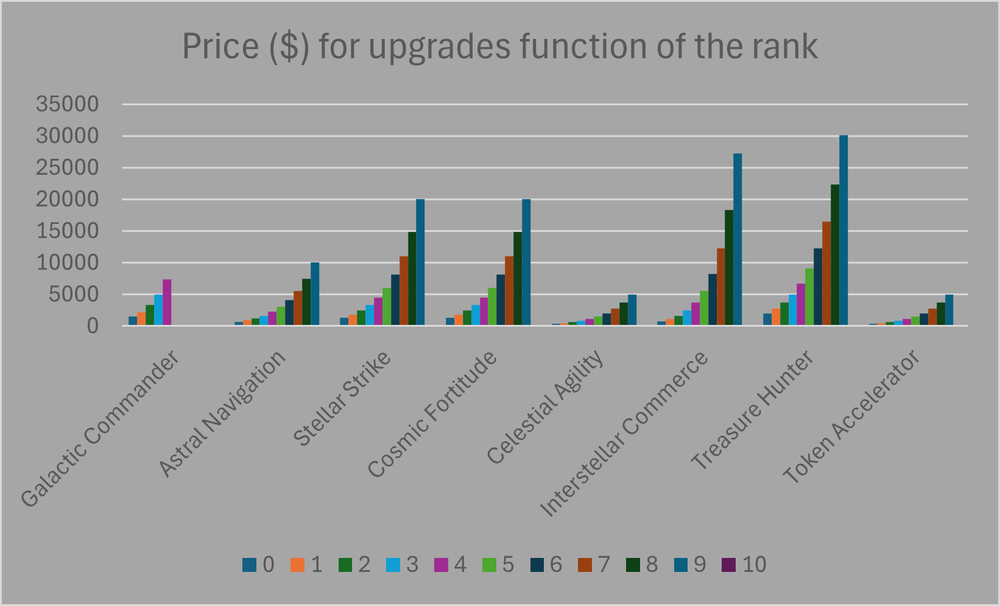
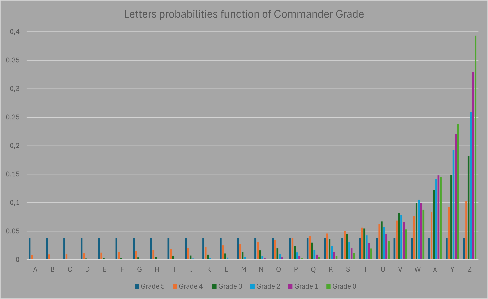
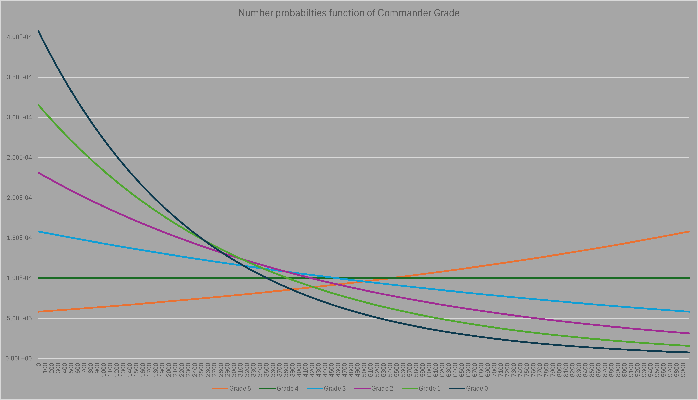
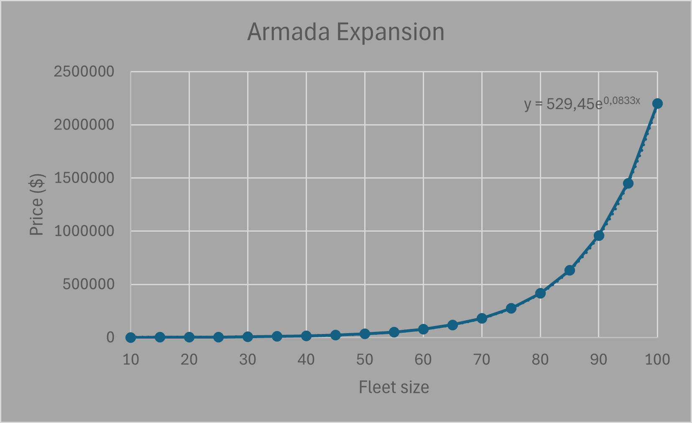

# Starwalkers 🚀

## Overview 🛸

Welcome to Starwalkers, a text-based space adventure where you command a fleet of starships! Build your fleet, explore the cosmos, engage in tactical battles, and support your friends by sending credits.

## Features ✨

- **Build Your Fleet:** Purchase and customize starships to enhance your fleet's capabilities.
- **Tactical PvE Battles:** Challenge computer-controlled enemies in strategic text-based combat.
- **Support Friends:** Send credits to friends to help them on their journey.
- **Progression and Upgrades:** Enhance your fleet's capabilities with future upgrade options.

## How to Play 🎮

1. **Installation:**
   - Clone the repository: `git clone https://github.com/jumitti/starwalkers.git`
   - Install dependencies: `pip install -r requirements.txt`

2. **Launching the Game:**
   - Navigate to the project directory.
   - Run the game: `streamlit run starwalkers_streamlit.py`

3. **Running Backup Script:**
   - For database backup, run `python scheduled_tasks.py` in parallel to ensure data safety during updates or unexpected events.

4. **Gameplay Tips:**
   - Purchase new ships to expand and strengthen your fleet.
   - Explore different sectors to discover valuable resources and artifacts.
   - Engage in text-based PvE combat to earn rewards and progress.

## Future Updates 🔮

We're continuously enhancing Starwalkers to provide a richer text-based gaming experience:

- **Marketplace:** Soon, trade ships and resources with other players through the marketplace.
- **Expanded Gameplay:** Look forward to more dynamic features and challenges.

Stay tuned for updates!

## Documentation 📚
### Price of ranks per Skills and Upgrades

### 1. Galactic Commander 🧑🏽‍🚀
The Galactic Commander grade allows you to increase your chances of obtaining a better shuttle. But be careful, the shuttles will cost $10 more for each
grade.

| Grade | Galactic Commander ($) |
|-------|------------------------|
| 0     | 1491,824698            |
| 1     | 2225,540928            |
| 2     | 3320,116923            |
| 3     | 4953,032424            |
| 4     | 7389,056099            |
| 5     | MAX                    |

### 2. Astral Navigation
The Astral Navigator grade reduces the cost of sending shuttles into Open Space (-2.5% per grade) and speeds up the obtaining of resources (-2 min per grade)

| Grade | Astral Navigation ($) |
|-------|-----------------------|
| 0     | 674,9294038           |
| 1     | 911,0594002           |
| 2     | 1229,801556           |
| 3     | 1660,058461           |
| 4     | 2240,844535           |
| 5     | 3024,823732           |
| 6     | 4083,084956           |
| 7     | 5511,58819            |
| 8     | 7439,865862           |
| 9     | 10042,76846           |
| 10    | MAX                   |

### 3. Stellar Strike
The Stellar Striker rank increases your damage during battles. Your damage is randomly multiplied by a factor of 1 and your rank (+2.5% per rank)

| Grade | Stellar Strike ($) |
|-------|--------------------|
| 0     | 1349,858808        |
| 1     | 1822,1188          |
| 2     | 2459,603111        |
| 3     | 3320,116923        |
| 4     | 4481,68907         |
| 5     | 6049,647464        |
| 6     | 8166,169913        |
| 7     | 11023,17638        |
| 8     | 14879,73172        |
| 9     | 20085,53692        |
| 10    | MAX                |

### 4. Cosmic Fortitude
The Cosmic Fortitude grade reduces damage suffered during battle. The damage suffered is multiplied randomly by a factor between your rank (-2.5% per rank) and 1.

| Grade | Cosmic Fortitude ($) |
|-------|----------------------|
| 0     | 1349,858808          |
| 1     | 1822,1188            |
| 2     | 2459,603111          |
| 3     | 3320,116923          |
| 4     | 4481,68907           |
| 5     | 6049,647464          |
| 6     | 8166,169913          |
| 7     | 11023,17638          |
| 8     | 14879,73172          |
| 9     | 20085,53692          |
| 10    | MAX                  |

### 5. Celestial Agility
The Celestial Agility rank increases your chance of fleeing from an enemy (+9% per rank)

| Grade | Celestial Agility ($) |
|-------|-----------------------|
| 0     | 337,4647019           |
| 1     | 455,5297001           |
| 2     | 614,9007778           |
| 3     | 830,0292307           |
| 4     | 1120,422268           |
| 5     | 1512,411866           |
| 6     | 2041,542478           |
| 7     | 2755,794095           |
| 8     | 3719,932931           |
| 9     | 5021,384231           |
| 10    | MAX                   |

### 6. Interstellar Commerce
The Interstellar Commerce grade discounts the price of shuttles by 5% per rank

| Grade | Interstellar Commerce ($) |
|-------|---------------------------|
| 0     | 745,9123488               |
| 1     | 1112,770464               |
| 2     | 1660,058461               |
| 3     | 2476,516212               |
| 4     | 3694,528049               |
| 5     | 5511,58819                |
| 6     | 8222,323386               |
| 7     | 12266,2651                |
| 8     | 18299,11722               |
| 9     | 27299,07502               |
| 10    | MAX                       |

### 7. Treasure Hunter
The Treasure Hunter rank increases the money earned (+5% per rank), the resources found (+2.5% per rank) and the probability of obtaining an Artifact (+0.01% per rank). Money and resources are multiplied by a factor between 1 and your rank.
You have a 0.01% chance of finding an Artifact without a bonus. Up to you !

| Grade | Treasure Hunter ($) |
|-------|---------------------|
| 0     | 2024,788211         |
| 1     | 2733,178201         |
| 2     | 3689,404667         |
| 3     | 4980,175384         |
| 4     | 6722,533606         |
| 5     | 9074,471197         |
| 6     | 12249,25487         |
| 7     | 16534,76457         |
| 8     | 22319,59759         |
| 9     | 30128,30538         |
| 10    | MAX                 |

### 8. Token Accelerator
The Token Accelerator rank gives you additional battle trophies. Thus, Trade Tokens will no longer be a problem (+1 battle trophy per rank). During battle, you gain a random number between 0 and your battle trophy rank in addition.

| Grade | Token Accelerator ($) |
|-------|-----------------------|
| 0     | 337,4647019           |
| 1     | 455,5297001           |
| 2     | 614,9007778           |
| 3     | 830,0292307           |
| 4     | 1120,422268           |
| 5     | 1512,411866           |
| 6     | 2041,542478           |
| 7     | 2755,794095           |
| 8     | 3719,932931           |
| 9     | 5021,384231           |
| 10    | MAX                   |

### 9. Armada Expansion
The Armada Expansion rank increases the size of your space fleet by 5 places.

| Fleet size | Armada Expansion ($) |
|------------|----------------------|
| 10         | 1218,249396          |
| 15         | 1847,958606          |
| 20         | 2803,162489          |
| 25         | 4252,1082            |
| 30         | 6450,009306          |
| 35         | 9783,998454          |
| 40         | 14841,31591          |
| 45         | 22512,74456          |
| 50         | 34149,5101           |
| 55         | 51801,28247          |
| 60         | 78577,19942          |
| 65         | 119193,5021          |
| 70         | 180804,2414          |
| 75         | 274261,3746          |
| 80         | 416026,2005          |
| 85         | 631068,8108          |
| 90         | 957266,2574          |
| 95         | 1452074,119          |
| 100        | 2202646,579          |
| ...        | NO LIMIT             |

## Security 🔐

Starwalkers prioritizes the security of player accounts through the following measures:

- **Password Encryption:** User passwords are securely encrypted using bcrypt hashing algorithm.
- **Database Access:** Access to user data is managed through secure SQLite database connections.
- **Authentication:** Players must create an account with a unique username and securely encrypted password.

## Support 🛠️

For any inquiries or feedback, please contact us with [Issues](https://github.com/Jumitti/starwalkers/issues). We'd love to hear from you!

## Credits 🪪

- **[Julien Minniti](https://github.com/Jumitti)**: Lead developer and creator of Starwalkers Streamlit and Telegram Bot.
- **[Gametoy20](https://github.com/Gametoy20)**: Original game concept creator and ongoing contributor.

## License 📜

This project is licensed under the [MIT License](../LICENSE).
